Crab Age Prediction
================
Trevor Okinda
2025

- [Student Details](#student-details)
- [Setup Chunk](#setup-chunk)
  - [Source:](#source)
  - [Reference:](#reference)
- [Understanding the Dataset (Exploratory Data Analysis
  (EDA))](#understanding-the-dataset-exploratory-data-analysis-eda)
  - [Load dataset](#load-dataset)
  - [Measures of Frequency](#measures-of-frequency)
  - [Measures of Central Tendency](#measures-of-central-tendency)
  - [Measures of Distribution](#measures-of-distribution)
  - [Measures of Relationship](#measures-of-relationship)
  - [ANOVA](#anova)
  - [Plots](#plots)
- [Preprocessing and Data
  Transformation](#preprocessing-and-data-transformation)
  - [Missing Values](#missing-values)
- [Training Model](#training-model)
  - [Data Splitting](#data-splitting)
  - [Bootstrapping](#bootstrapping)
  - [Cross-validation](#cross-validation)
  - [Train Different Models](#train-different-models)
  - [Performance Metrics](#performance-metrics)
- [Saving Model](#saving-model)

# Student Details

|                       |                     |
|-----------------------|---------------------|
| **Student ID Number** | 134780              |
| **Student Name**      | Trevor Okinda       |
| **BBIT 4.2 Group**    | C                   |
| **Project Name**      | Crab Age Prediction |

# Setup Chunk

**Note:** the following KnitR options have been set as the global
defaults: <BR>
`knitr::opts_chunk$set(echo = TRUE, warning = FALSE, eval = TRUE, collapse = FALSE, tidy = TRUE)`.

More KnitR options are documented here
<https://bookdown.org/yihui/rmarkdown-cookbook/chunk-options.html> and
here <https://yihui.org/knitr/options/>.

### Source:

The dataset that was used can be downloaded here:
*\<<a href="https://www.kaggle.com/datasets/sidhus/crab-age-prediction\"
class="uri">https://www.kaggle.com/datasets/sidhus/crab-age-prediction\</a>\>*

### Reference:

*\<Sidhu, G. S. (2021). Crab Age Prediction \[Data set\]. Kaggle.
<a href="https://www.kaggle.com/datasets/sidhus/crab-age-prediction\"
class="uri">https://www.kaggle.com/datasets/sidhus/crab-age-prediction\</a>\>  
Refer to the APA 7th edition manual for rules on how to cite datasets:
<https://apastyle.apa.org/style-grammar-guidelines/references/examples/data-set-references>*

# Understanding the Dataset (Exploratory Data Analysis (EDA))

## Load dataset

``` r
# Load dataset
crab_data <- read.csv("CrabAgePrediction.csv", colClasses = c(
  Sex = "factor",
  Length = "numeric",
  Diameter = "numeric",
  Height = "numeric",
  Weight = "numeric",
  Shucked_Weight = "numeric",
  Viscera_Weight = "numeric",
  Shell_Weight = "numeric",
  Age = "integer"
))

# Display the structure of the dataset
str(crab_data)
```

    ## 'data.frame':    3893 obs. of  9 variables:
    ##  $ Sex           : Factor w/ 3 levels "F","I","M": 1 3 2 1 2 1 1 3 2 2 ...
    ##  $ Length        : num  1.438 0.887 1.038 1.175 0.887 ...
    ##  $ Diameter      : num  1.175 0.65 0.775 0.887 0.662 ...
    ##  $ Height        : num  0.412 0.212 0.25 0.25 0.212 ...
    ##  $ Weight        : num  24.64 5.4 7.95 13.48 6.9 ...
    ##  $ Shucked_Weight: num  12.33 2.3 3.23 4.75 3.46 ...
    ##  $ Viscera_Weight: num  5.58 1.37 1.6 2.28 1.49 ...
    ##  $ Shell_Weight  : num  6.75 1.56 2.76 5.24 1.7 ...
    ##  $ Age           : int  9 6 6 10 6 8 15 10 13 7 ...

``` r
# View the first few rows of the dataset
head(crab_data)
```

    ##   Sex Length Diameter Height    Weight Shucked_Weight Viscera_Weight
    ## 1   F 1.4375   1.1750 0.4125 24.635715      12.332033       5.584852
    ## 2   M 0.8875   0.6500 0.2125  5.400580       2.296310       1.374951
    ## 3   I 1.0375   0.7750 0.2500  7.952035       3.231843       1.601747
    ## 4   F 1.1750   0.8875 0.2500 13.480187       4.748541       2.282135
    ## 5   I 0.8875   0.6625 0.2125  6.903103       3.458639       1.488349
    ## 6   F 1.5500   1.1625 0.3500 28.661344      13.579410       6.761356
    ##   Shell_Weight Age
    ## 1     6.747181   9
    ## 2     1.559222   6
    ## 3     2.764076   6
    ## 4     5.244657  10
    ## 5     1.700970   6
    ## 6     7.229122   8

``` r
# View the dataset in a separate viewer window
View(crab_data)
```

## Measures of Frequency

``` r
# Load necessary libraries
library(ggplot2)

# Frequency distribution of categorical variable 'Sex'
sex_frequency <- table(crab_data$Sex)
print(sex_frequency)
```

    ## 
    ##    F    I    M 
    ## 1225 1233 1435

``` r
# Plot frequency distribution of 'Sex'
ggplot(crab_data, aes(x = Sex)) + 
  geom_bar(fill = "lightblue", color = "black") +
  labs(title = "Frequency Distribution of Sex", x = "Sex", y = "Frequency")
```

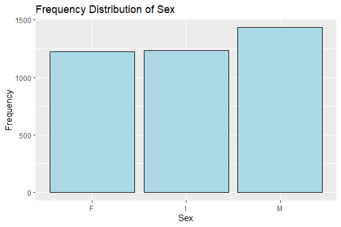<!-- -->

## Measures of Central Tendency

``` r
# Mean of numeric variables
mean_length <- mean(crab_data$Length, na.rm = TRUE)
mean_diameter <- mean(crab_data$Diameter, na.rm = TRUE)
mean_height <- mean(crab_data$Height, na.rm = TRUE)
mean_weight <- mean(crab_data$Weight, na.rm = TRUE)
mean_shucked_weight <- mean(crab_data$Shucked_Weight, na.rm = TRUE)
mean_viscera_weight <- mean(crab_data$Viscera_Weight, na.rm = TRUE)
mean_shell_weight <- mean(crab_data$Shell_Weight, na.rm = TRUE)
mean_age <- mean(crab_data$Age, na.rm = TRUE)

print(c(mean_length, mean_diameter, mean_height, mean_weight, mean_shucked_weight, mean_viscera_weight, mean_shell_weight, mean_age))
```

    ## [1]  1.3113055  1.0208933  0.3493739 23.5672751 10.2073420  5.1365464  6.7958441
    ## [8]  9.9547906

``` r
# Median of numeric variables
median_length <- median(crab_data$Length, na.rm = TRUE)
median_diameter <- median(crab_data$Diameter, na.rm = TRUE)
median_height <- median(crab_data$Height, na.rm = TRUE)
median_weight <- median(crab_data$Weight, na.rm = TRUE)
median_shucked_weight <- median(crab_data$Shucked_Weight, na.rm = TRUE)
median_viscera_weight <- median(crab_data$Viscera_Weight, na.rm = TRUE)
median_shell_weight <- median(crab_data$Shell_Weight, na.rm = TRUE)
median_age <- median(crab_data$Age, na.rm = TRUE)

print(c(median_length, median_diameter, median_height, median_weight, median_shucked_weight, median_viscera_weight, median_shell_weight, median_age))
```

    ## [1]  1.362500  1.062500  0.362500 22.792998  9.539607  4.861939  6.662133
    ## [8] 10.000000

## Measures of Distribution

``` r
# Standard deviation of numeric variables
sd_length <- sd(crab_data$Length, na.rm = TRUE)
sd_diameter <- sd(crab_data$Diameter, na.rm = TRUE)
sd_height <- sd(crab_data$Height, na.rm = TRUE)
sd_weight <- sd(crab_data$Weight, na.rm = TRUE)
sd_shucked_weight <- sd(crab_data$Shucked_Weight, na.rm = TRUE)
sd_viscera_weight <- sd(crab_data$Viscera_Weight, na.rm = TRUE)
sd_shell_weight <- sd(crab_data$Shell_Weight, na.rm = TRUE)
sd_age <- sd(crab_data$Age, na.rm = TRUE)

print(c(sd_length, sd_diameter, sd_height, sd_weight, sd_shucked_weight, sd_viscera_weight, sd_shell_weight, sd_age))
```

    ## [1]  0.3004306  0.2482327  0.1049762 13.8912007  6.2752747  3.1041331  3.9433917
    ## [8]  3.2209666

``` r
# Plot distribution of 'Length'
ggplot(crab_data, aes(x = Length)) + 
  geom_histogram(binwidth = 0.1, fill = "lightgreen", color = "black") +
  labs(title = "Distribution of Length", x = "Length", y = "Frequency")
```

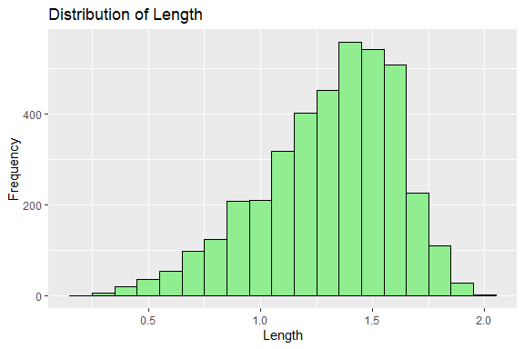<!-- -->

## Measures of Relationship

``` r
# Correlation matrix of numeric variables
cor_matrix <- cor(crab_data[, c("Length", "Diameter", "Height", "Weight", "Shucked_Weight", "Viscera_Weight", "Shell_Weight", "Age")], use = "complete.obs")
print(cor_matrix)
```

    ##                   Length  Diameter    Height    Weight Shucked_Weight
    ## Length         1.0000000 0.9866532 0.8230810 0.9253735      0.8981807
    ## Diameter       0.9866532 1.0000000 0.8295315 0.9257697      0.8936257
    ## Height         0.8230810 0.8295315 1.0000000 0.8144051      0.7709611
    ## Weight         0.9253735 0.9257697 0.8144051 1.0000000      0.9690773
    ## Shucked_Weight 0.8981807 0.8936257 0.7709611 0.9690773      1.0000000
    ## Viscera_Weight 0.9032528 0.8998103 0.7932717 0.9655833      0.9312796
    ## Shell_Weight   0.8977363 0.9055611 0.8122905 0.9552690      0.8824063
    ## Age            0.5549733 0.5738443 0.5519564 0.5388194      0.4187598
    ##                Viscera_Weight Shell_Weight       Age
    ## Length              0.9032528    0.8977363 0.5549733
    ## Diameter            0.8998103    0.9055611 0.5738443
    ## Height              0.7932717    0.8122905 0.5519564
    ## Weight              0.9655833    0.9552690 0.5388194
    ## Shucked_Weight      0.9312796    0.8824063 0.4187598
    ## Viscera_Weight      1.0000000    0.9061047 0.5013278
    ## Shell_Weight        0.9061047    1.0000000 0.6251950
    ## Age                 0.5013278    0.6251950 1.0000000

``` r
# Plot correlation matrix
library(corrplot)
```

    ## corrplot 0.95 loaded

``` r
corrplot(cor_matrix, method = "circle")
```

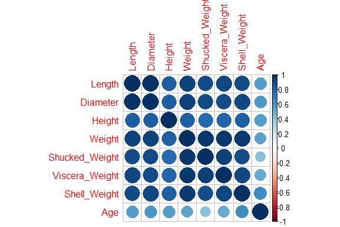<!-- -->

``` r
# Scatter plot of Length vs Age
ggplot(crab_data, aes(x = Length, y = Age)) + 
  geom_point(color = "blue") +
  geom_smooth(method = "lm", color = "red") +
  labs(title = "Length vs Age", x = "Length", y = "Age")
```

    ## `geom_smooth()` using formula = 'y ~ x'

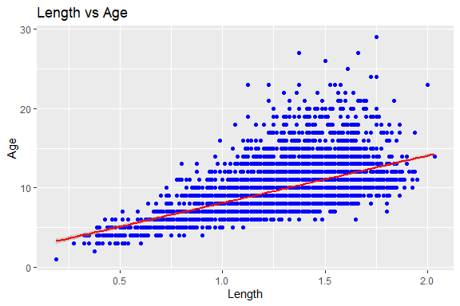<!-- -->

## ANOVA

``` r
# Load necessary library
library(ggplot2)
library(dplyr)
```

    ## 
    ## Attaching package: 'dplyr'

    ## The following objects are masked from 'package:stats':
    ## 
    ##     filter, lag

    ## The following objects are masked from 'package:base':
    ## 
    ##     intersect, setdiff, setequal, union

``` r
library(car)
```

    ## Loading required package: carData

    ## 
    ## Attaching package: 'car'

    ## The following object is masked from 'package:dplyr':
    ## 
    ##     recode

``` r
# ANOVA: Weight by Sex
anova_result <- aov(Weight ~ Sex, data = crab_data)
summary(anova_result)
```

    ##               Df Sum Sq Mean Sq F value Pr(>F)    
    ## Sex            2 233129  116564   875.5 <2e-16 ***
    ## Residuals   3890 517893     133                   
    ## ---
    ## Signif. codes:  0 '***' 0.001 '**' 0.01 '*' 0.05 '.' 0.1 ' ' 1

``` r
# Post-hoc test if ANOVA is significant
if (summary(anova_result)[[1]][["Pr(>F)"]][1] < 0.05) {
  print("ANOVA is significant, performing post-hoc test (Tukey HSD)...")
  tukey_result <- TukeyHSD(anova_result)
  print(tukey_result)
} else {
  print("ANOVA is not significant, no need for post-hoc test.")
}
```

    ## [1] "ANOVA is significant, performing post-hoc test (Tukey HSD)..."
    ##   Tukey multiple comparisons of means
    ##     95% family-wise confidence level
    ## 
    ## Fit: aov(formula = Weight ~ Sex, data = crab_data)
    ## 
    ## $Sex
    ##           diff        lwr         upr     p adj
    ## I-F -17.423042 -18.514370 -16.3317136 0.0000000
    ## M-F  -1.568895  -2.621247  -0.5165437 0.0013895
    ## M-I  15.854146  14.803638  16.9046546 0.0000000

``` r
# Boxplot to visualize differences in Weight by Sex
ggplot(crab_data, aes(x = Sex, y = Weight)) + 
  geom_boxplot(fill = 'orange', color = 'black') +
  labs(title = "Boxplot of Weight by Sex", x = "Sex", y = "Weight")
```

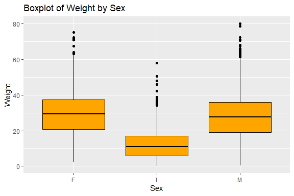<!-- -->

## Plots

``` r
# Load necessary libraries
library(ggplot2)
library(dplyr)

# Histogram for Length
ggplot(crab_data, aes(x = Length)) + 
  geom_histogram(binwidth = 0.1, fill = 'blue', color = 'black') +
  labs(title = "Histogram of Length", x = "Length", y = "Frequency")
```

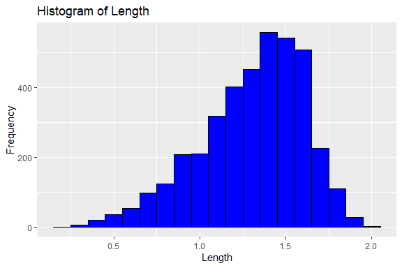<!-- -->

``` r
# Density plot for Weight
ggplot(crab_data, aes(x = Weight)) + 
  geom_density(fill = 'green', alpha = 0.5) +
  labs(title = "Density Plot of Weight", x = "Weight", y = "Density")
```

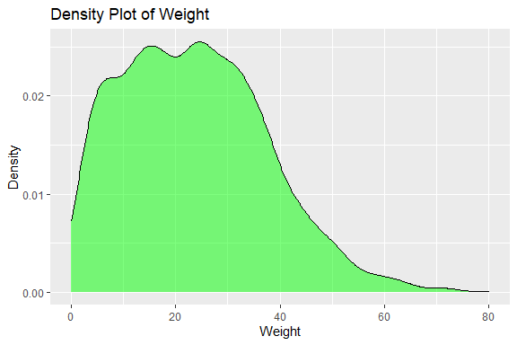<!-- -->

``` r
# Bar plot for categorical variable (Sex)
ggplot(crab_data, aes(x = Sex)) + 
  geom_bar(fill = 'purple', color = 'black') +
  labs(title = "Bar Plot of Sex", x = "Sex", y = "Count")
```

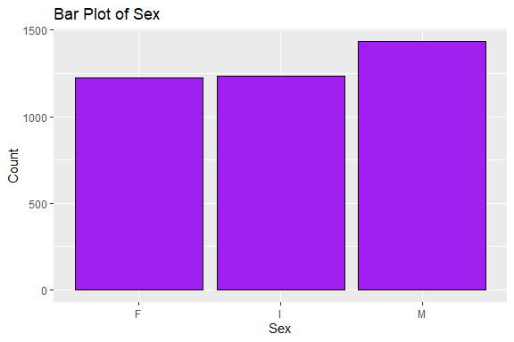<!-- -->

``` r
# Scatter plot between Length and Weight colored by Sex
ggplot(crab_data, aes(x = Length, y = Weight, color = Sex)) + 
  geom_point() + 
  labs(title = "Scatter Plot of Length vs Weight", x = "Length", y = "Weight")
```

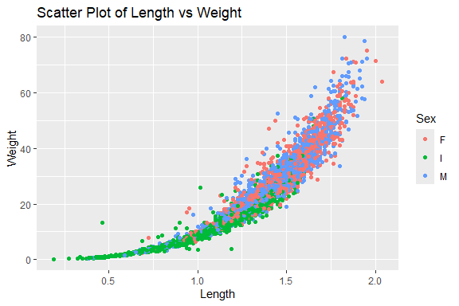<!-- -->

``` r
# Pair plot for numeric variables
pairs(crab_data[, sapply(crab_data, is.numeric)], main = "Pairwise Scatter Plots", 
      pch = 19, col = crab_data$Sex)
```

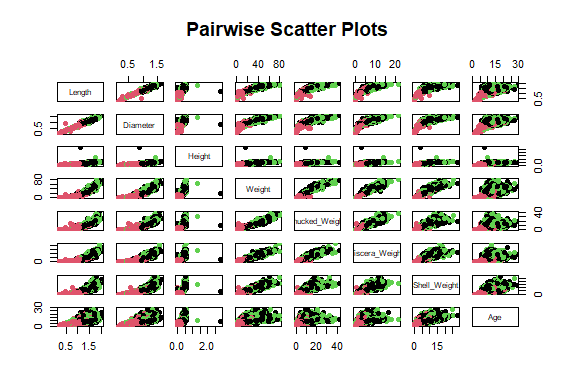<!-- -->

``` r
# Enhanced pair plot using GGally package
library(GGally)
```

    ## Registered S3 method overwritten by 'GGally':
    ##   method from   
    ##   +.gg   ggplot2

``` r
ggpairs(crab_data, aes(color = Sex, alpha = 0.5))
```

    ## `stat_bin()` using `bins = 30`. Pick better value with `binwidth`.

    ## `stat_bin()` using `bins = 30`. Pick better value with `binwidth`.
    ## `stat_bin()` using `bins = 30`. Pick better value with `binwidth`.
    ## `stat_bin()` using `bins = 30`. Pick better value with `binwidth`.
    ## `stat_bin()` using `bins = 30`. Pick better value with `binwidth`.
    ## `stat_bin()` using `bins = 30`. Pick better value with `binwidth`.
    ## `stat_bin()` using `bins = 30`. Pick better value with `binwidth`.
    ## `stat_bin()` using `bins = 30`. Pick better value with `binwidth`.

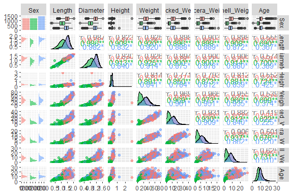<!-- -->

``` r
# Box plot for Length by Sex
ggplot(crab_data, aes(x = Sex, y = Length)) + 
  geom_boxplot(fill = 'orange', color = 'black') +
  labs(title = "Box Plot of Length by Sex", x = "Sex", y = "Length")
```

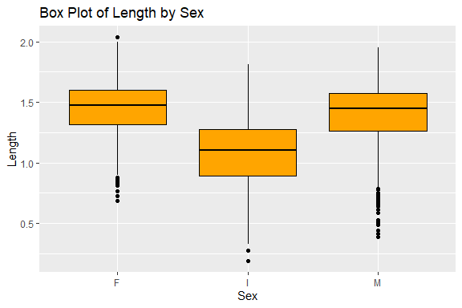<!-- -->

``` r
# Violin plot for Weight by Sex
ggplot(crab_data, aes(x = Sex, y = Weight)) + 
  geom_violin(fill = 'cyan', color = 'black') +
  labs(title = "Violin Plot of Weight by Sex", x = "Sex", y = "Weight")
```

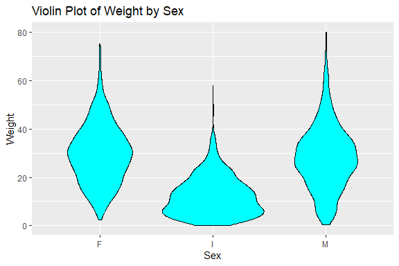<!-- -->

# Preprocessing and Data Transformation

## Missing Values

``` r
# Check for missing values in each column
missing_values <- sapply(crab_data, function(x) sum(is.na(x)))
print(missing_values)
```

    ##            Sex         Length       Diameter         Height         Weight 
    ##              0              0              0              0              0 
    ## Shucked_Weight Viscera_Weight   Shell_Weight            Age 
    ##              0              0              0              0

``` r
# Display the columns with missing values and their counts
missing_values_df <- data.frame(Column = names(missing_values), MissingValues = missing_values)
print(missing_values_df)
```

    ##                        Column MissingValues
    ## Sex                       Sex             0
    ## Length                 Length             0
    ## Diameter             Diameter             0
    ## Height                 Height             0
    ## Weight                 Weight             0
    ## Shucked_Weight Shucked_Weight             0
    ## Viscera_Weight Viscera_Weight             0
    ## Shell_Weight     Shell_Weight             0
    ## Age                       Age             0

``` r
# Visualize missing values using the VIM package
library(VIM)
```

    ## Loading required package: colorspace

    ## Loading required package: grid

    ## The legacy packages maptools, rgdal, and rgeos, underpinning the sp package,
    ## which was just loaded, will retire in October 2023.
    ## Please refer to R-spatial evolution reports for details, especially
    ## https://r-spatial.org/r/2023/05/15/evolution4.html.
    ## It may be desirable to make the sf package available;
    ## package maintainers should consider adding sf to Suggests:.
    ## The sp package is now running under evolution status 2
    ##      (status 2 uses the sf package in place of rgdal)

    ## VIM is ready to use.

    ## Suggestions and bug-reports can be submitted at: https://github.com/statistikat/VIM/issues

    ## 
    ## Attaching package: 'VIM'

    ## The following object is masked from 'package:datasets':
    ## 
    ##     sleep

``` r
aggr(crab_data, col = c('navyblue', 'red'), numbers = TRUE, sortVars = TRUE, labels = names(crab_data), cex.axis = 0.7, gap = 3, ylab = c("Missing data", "Pattern"))
```

<!-- -->

    ## 
    ##  Variables sorted by number of missings: 
    ##        Variable Count
    ##             Sex     0
    ##          Length     0
    ##        Diameter     0
    ##          Height     0
    ##          Weight     0
    ##  Shucked_Weight     0
    ##  Viscera_Weight     0
    ##    Shell_Weight     0
    ##             Age     0

# Training Model

## Data Splitting

``` r
# Load necessary libraries
library(caret)
```

    ## Loading required package: lattice

``` r
library(dplyr)

# Split the data into training (80%) and test (20%) sets
set.seed(123)
trainIndex <- createDataPartition(crab_data$Age, p = 0.8, list = FALSE)
train_data <- crab_data[trainIndex,]
test_data <- crab_data[-trainIndex,]

# Display the size of training and test sets
cat("Training set size:", nrow(train_data), "\n")
```

    ## Training set size: 3117

``` r
cat("Test set size:", nrow(test_data), "\n")
```

    ## Test set size: 776

## Bootstrapping

``` r
# Load necessary libraries
library(boot)
```

    ## 
    ## Attaching package: 'boot'

    ## The following object is masked from 'package:lattice':
    ## 
    ##     melanoma

    ## The following object is masked from 'package:car':
    ## 
    ##     logit

``` r
# Define a function to calculate the mean of Weight
mean_weight <- function(data, indices) {
  sample_data <- data[indices, ]
  return(mean(sample_data$Weight))
}

# Perform bootstrapping
set.seed(123)
boot_results <- boot(data = crab_data, statistic = mean_weight, R = 1000)

# Display bootstrapping results
print(boot_results)
```

    ## 
    ## ORDINARY NONPARAMETRIC BOOTSTRAP
    ## 
    ## 
    ## Call:
    ## boot(data = crab_data, statistic = mean_weight, R = 1000)
    ## 
    ## 
    ## Bootstrap Statistics :
    ##     original       bias    std. error
    ## t1* 23.56728 -0.004976455   0.2152089

``` r
# Plot the bootstrapping results
plot(boot_results)
```

<!-- -->

## Cross-validation

``` r
# Load necessary libraries
library(caret)

# Define a control function for k-fold cross-validation
control <- trainControl(method = "cv", number = 10)

# Train a linear regression model using k-fold cross-validation
set.seed(123)
cv_model <- train(Age ~ Length + Diameter + Height + Weight + Shucked_Weight + Viscera_Weight + Shell_Weight,
                  data = train_data,
                  method = "lm",
                  trControl = control)

# Display the cross-validation results
print(cv_model)
```

    ## Linear Regression 
    ## 
    ## 3117 samples
    ##    7 predictor
    ## 
    ## No pre-processing
    ## Resampling: Cross-Validated (10 fold) 
    ## Summary of sample sizes: 2804, 2805, 2804, 2806, 2806, 2806, ... 
    ## Resampling results:
    ## 
    ##   RMSE     Rsquared  MAE     
    ##   2.25488  0.509246  1.616641
    ## 
    ## Tuning parameter 'intercept' was held constant at a value of TRUE

``` r
# Predict on the test set
predictions <- predict(cv_model, newdata = test_data)

# Calculate and display performance metrics
mse <- mean((predictions - test_data$Age)^2)
rmse <- sqrt(mse)
cat("Mean Squared Error:", mse, "\n")
```

    ## Mean Squared Error: 4.979091

``` r
cat("Root Mean Squared Error:", rmse, "\n")
```

    ## Root Mean Squared Error: 2.231388

## Train Different Models

``` r
# Load necessary libraries
library(caret)
library(rpart)
library(randomForest)
```

    ## randomForest 4.7-1.1

    ## Type rfNews() to see new features/changes/bug fixes.

    ## 
    ## Attaching package: 'randomForest'

    ## The following object is masked from 'package:dplyr':
    ## 
    ##     combine

    ## The following object is masked from 'package:ggplot2':
    ## 
    ##     margin

``` r
# Train a linear regression model
lm_model <- train(Age ~ Length + Diameter + Height + Weight + Shucked_Weight + Viscera_Weight + Shell_Weight,
                  data = train_data,
                  method = "lm")

# Display the linear regression model summary
print(summary(lm_model$finalModel))
```

    ## 
    ## Call:
    ## lm(formula = .outcome ~ ., data = dat)
    ## 
    ## Residuals:
    ##     Min      1Q  Median      3Q     Max 
    ## -9.7934 -1.3645 -0.3848  0.8994 12.1761 
    ## 
    ## Coefficients:
    ##                Estimate Std. Error t value Pr(>|t|)    
    ## (Intercept)     2.93007    0.31031   9.442  < 2e-16 ***
    ## Length         -0.42240    0.83519  -0.506    0.613    
    ## Diameter        5.38386    1.02520   5.251 1.61e-07 ***
    ## Height          4.17748    0.65698   6.359 2.33e-10 ***
    ## Weight          0.32696    0.03003  10.888  < 2e-16 ***
    ## Shucked_Weight -0.71229    0.03361 -21.195  < 2e-16 ***
    ## Viscera_Weight -0.35089    0.05302  -6.618 4.28e-11 ***
    ## Shell_Weight    0.29498    0.04688   6.292 3.56e-10 ***
    ## ---
    ## Signif. codes:  0 '***' 0.001 '**' 0.01 '*' 0.05 '.' 0.1 ' ' 1
    ## 
    ## Residual standard error: 2.217 on 3109 degrees of freedom
    ## Multiple R-squared:  0.5237, Adjusted R-squared:  0.5226 
    ## F-statistic: 488.3 on 7 and 3109 DF,  p-value: < 2.2e-16

``` r
# Predict on the test set
lm_predictions <- predict(lm_model, newdata = test_data)

# Calculate performance metrics
lm_mse <- mean((lm_predictions - test_data$Age)^2)
lm_rmse <- sqrt(lm_mse)
cat("Linear Regression - Mean Squared Error:", lm_mse, "\n")
```

    ## Linear Regression - Mean Squared Error: 4.979091

``` r
cat("Linear Regression - Root Mean Squared Error:", lm_rmse, "\n")
```

    ## Linear Regression - Root Mean Squared Error: 2.231388

``` r
# Train a decision tree model
dt_model <- train(Age ~ Length + Diameter + Height + Weight + Shucked_Weight + Viscera_Weight + Shell_Weight,
                  data = train_data,
                  method = "rpart")

# Display the decision tree model summary
print(dt_model$finalModel)
```

    ## n= 3117 
    ## 
    ## node), split, n, deviance, yval
    ##       * denotes terminal node
    ## 
    ## 1) root 3117 32082.580  9.958293  
    ##   2) Shell_Weight< 4.812328 1070  5076.426  7.581308 *
    ##   3) Shell_Weight>=4.812328 2047 17800.480 11.200780  
    ##     6) Shell_Weight< 10.04281 1414  9766.728 10.608910 *
    ##     7) Shell_Weight>=10.04281 633  6431.918 12.522910 *

``` r
# Plot the decision tree
plot(dt_model$finalModel)
text(dt_model$finalModel, use.n = TRUE)
```

<!-- -->

``` r
# Predict on the test set
dt_predictions <- predict(dt_model, newdata = test_data)

# Calculate performance metrics
dt_mse <- mean((dt_predictions - test_data$Age)^2)
dt_rmse <- sqrt(dt_mse)
cat("Decision Tree - Mean Squared Error:", dt_mse, "\n")
```

    ## Decision Tree - Mean Squared Error: 7.297444

``` r
cat("Decision Tree - Root Mean Squared Error:", dt_rmse, "\n")
```

    ## Decision Tree - Root Mean Squared Error: 2.701378

``` r
# Train a random forest model
set.seed(123)
rf_model <- randomForest(Age ~ Length + Diameter + Height + Weight + Shucked_Weight + Viscera_Weight + Shell_Weight,
                         data = train_data, ntree = 500)

# Display the random forest model summary
print(rf_model)
```

    ## 
    ## Call:
    ##  randomForest(formula = Age ~ Length + Diameter + Height + Weight +      Shucked_Weight + Viscera_Weight + Shell_Weight, data = train_data,      ntree = 500) 
    ##                Type of random forest: regression
    ##                      Number of trees: 500
    ## No. of variables tried at each split: 2
    ## 
    ##           Mean of squared residuals: 4.649969
    ##                     % Var explained: 54.82

``` r
# Predict on the test set
rf_predictions <- predict(rf_model, newdata = test_data)

# Calculate performance metrics
rf_mse <- mean((rf_predictions - test_data$Age)^2)
rf_rmse <- sqrt(rf_mse)
cat("Random Forest - Mean Squared Error:", rf_mse, "\n")
```

    ## Random Forest - Mean Squared Error: 5.024096

``` r
cat("Random Forest - Root Mean Squared Error:", rf_rmse, "\n")
```

    ## Random Forest - Root Mean Squared Error: 2.24145

## Performance Metrics

``` r
# Load necessary libraries
library(caret)
library(dplyr)
library(reshape2)

# Define training control
train_control <- trainControl(method = "cv", number = 10)

# Define models
models <- list(
  "Linear Regression" = list(model = "lm", method = "lm"),
  "Decision Tree" = list(model = "rpart", method = "rpart"),
  "Random Forest" = list(model = "rf", method = "rf")
)

# Train and evaluate models
results <- lapply(models, function(model) {
  set.seed(123)
  train(Age ~ Length + Diameter + Height + Weight + Shucked_Weight + Viscera_Weight + Shell_Weight,
        data = crab_data,
        method = model$method,
        trControl = train_control)
})

# Extract performance metrics
performance <- lapply(results, function(model) {
  resamples <- model$resample
  resamples$Model <- rownames(resamples)
  return(resamples)
})

# Combine results into a single data frame
performance_df <- do.call(rbind, performance)

# Reshape data for visualization
performance_melted <- melt(performance_df, id.vars = "Model", variable.name = "Metric", value.name = "Value")

# Plot model performance
ggplot(performance_melted, aes(x = Model, y = Value, fill = Model)) +
  geom_boxplot() +
  facet_wrap(~ Metric, scales = "free_y") +
  labs(title = "Model Performance Comparison", y = "Value")
```

<!-- -->

# Saving Model

``` r
# Saving the linear regression model
saveRDS(lm_model, "./models/saved_lm_model.rds")

# Load the saved model
loaded_lm_model <- readRDS("./models/saved_lm_model.rds")

# Prepare new data for prediction
new_data <- data.frame(
  Length = 1.5,
  Diameter = 1.2,
  Height = 0.4,
  Weight = 30,
  Shucked_Weight = 15,
  Viscera_Weight = 7,
  Shell_Weight = 8
)

# Use the loaded model to make predictions
predictions_loaded_model <- predict(loaded_lm_model, newdata = new_data)

# Print predictions
print(predictions_loaded_model)
```

    ##        1 
    ## 9.456157
